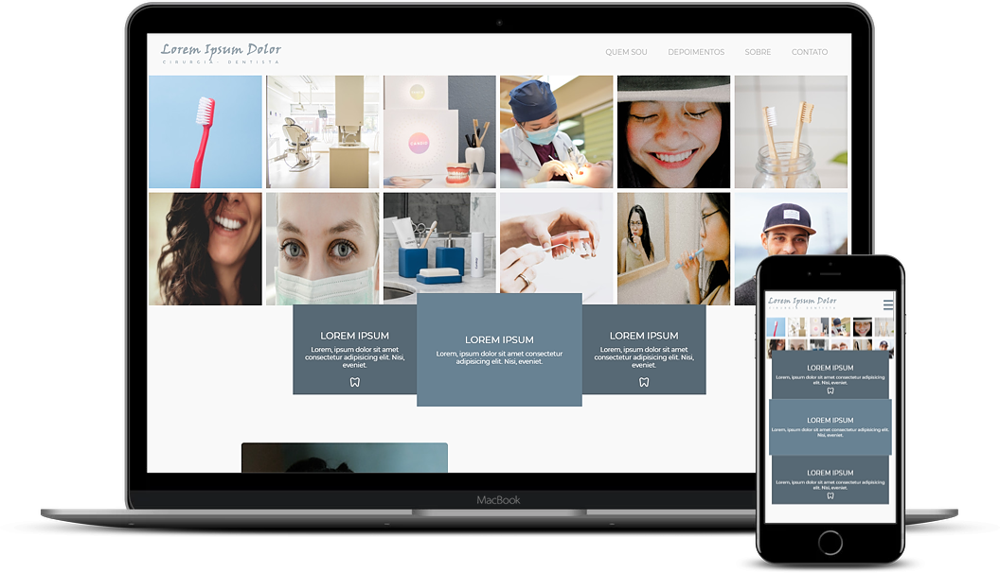

<h1 align="center">
 
Projeto 04
 
 
  
</h1>

## :rocket: Sobre

Quarto projeto desenvolvido no curso, Landing Page Denstista.

## :computer: Tecnologias
- [HTML](https://devdocs.io/html/)
- [CSS](https://devdocs.io/css/)
- [Responsive Web Design](https://www.w3schools.com/html/html_responsive.asp)

### :camera: Mais screenshots

<h1 align="center">
 
  
  
  
  
  
</h1>