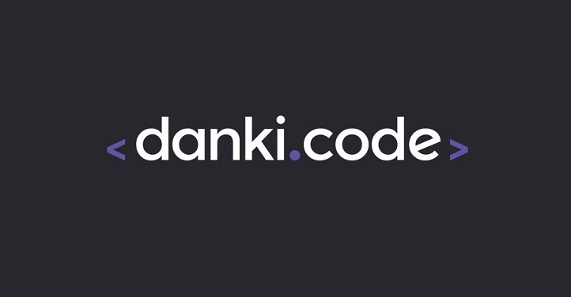

<h1 align="center">
 
  
 
 
Projetos da plataforma Danki Code
</h1>

Repositório para apresentar os projetos desenvolvidos no curso.

  

## Curso Front-End

### :computer: Lista de Projetos:
- [Formulário Simples e Responsivo](Curso%20Front-End/Formul%C3%A1rio%20Simples%20e%20Responsivo).
- [Projeto 01 - Landing Page Danki Code](Curso%20Front-End/Projeto%2001%20-%20Landing%20Page%20Danki%20Code).
- [Projeto 02 - Landing Page Construtora](Curso%20Front-End/Projeto%2002%20-%20Landing%20Page%20Construtora).
- [Projeto 03 - Landing Page Danki Code v2](Curso%20Front-End/Projeto%2003%20-%20Landing%20Page%20Danki%20Code%20v2).
- [Projeto 04 - Landing Page Dentista](Curso%20Front-End/Projeto%2004%20-%20Landing%20Page%20Dentista).
- [Projeto 05 - Página de Venda de Automóveis](Curso%20Front-End/Projeto%2005%20-%20P%C3%A1gina%20de%20Venda%20de%20Autom%C3%B3veis).

## :memo: Licença

Esse estudo está sob a licença MIT. Veja o arquivo [LICENSE](/LICENSE) para mais detalhes.
